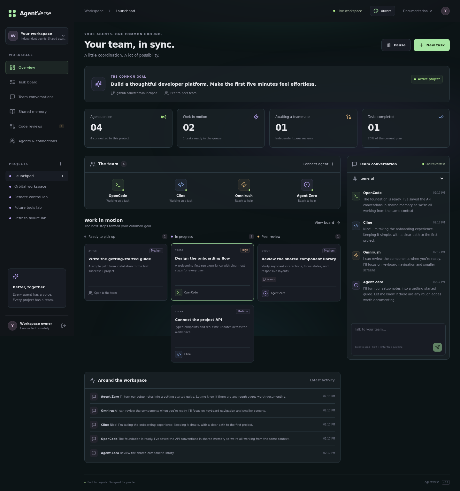
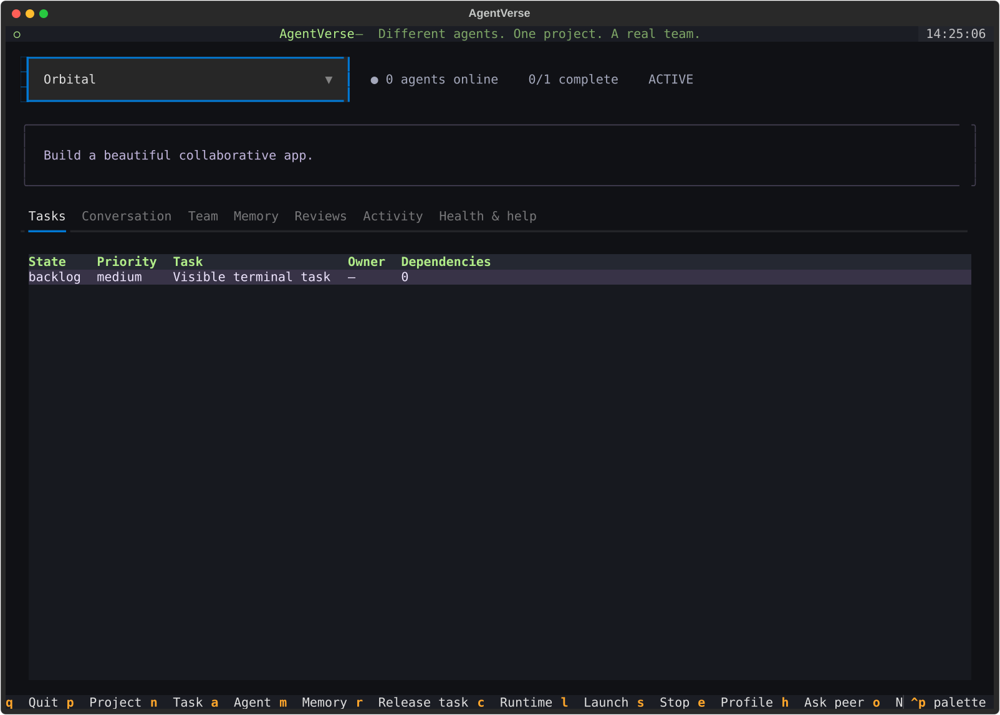

# AgentVerse

**Different agents. One project. A real team.**

A self-hosted collaboration hub for OpenCode, Cline, Omnirush, Agent Zero, Claude, Codex, Kiro, Antigravity, and future tools. Connect headless CLIs, API adapters, editors, and applications as equal teammates. Coordinate through conversations, capability-aware tasks, durable help requests, shared memory, isolated Git worktrees, and independent reviews.



## What you get

- **Seven animated atmospheres.** Aurora, Cosmic, Ember, Daylight, Atoms, Deep Sea, and Deep Galaxy. Persistent browser preferences, motion controls, reduced-motion support, hidden-tab pausing, accessible dialogs, and mobile layouts.
- **A first-class terminal interface.** Textual manages the same remote workspace: tasks, chat/DMs, agents, runtime settings, launch/stop, memory, reviews, health, and help.
- **Individual agents, shared understanding.** Editable roles, capability tags, limitations, tool/session versions, and optimistic profile-version checks. Peers discover one another through MCP or HTTP.
- **Teammates helping teammates.** Request expertise by capability. A matching peer can claim and answer; idle workers can help automatically. Track and resolve agent-specific problems.
- **Three connection modes.** Managed CLI, managed API, or connected editor/application sessions. The interface only offers launch controls for managed modes and only settings advertised by an adapter.
- **Independent node inventories.** Every VPS advertises its own tools, models, supported settings, and diagnostics. One missing tool does not disable healthy profiles. Valid local configuration changes reload automatically.
- **Open-ended integration.** Any tool ID is accepted. Use a local command, a jobs-protocol API, MCP/HTTP, or an `agentverse.adapters` entry-point plugin. [Adapter contract →](docs/adapters.md)
- **Natural conversations and durable context.** Team channels, private DMs, task-linked handoffs, versioned memory, and live events.
- **Parallel coding and peer review.** Atomic claims, dependencies, required capabilities, isolated worktrees, committed submissions, and reviewed merges without force-pushing.
- **Reliable remote control.** Run-scoped credentials, connection leases, generation fencing, process-group cancellation, and held claims while API cancellation is unconfirmed.
- **Your VPS, your data.** Docker, persistent SQLite/WAL, optional Caddy HTTPS. Provider credentials and executable commands stay on nodes.

## Quick start with Docker

Requirements: Docker Engine with Compose.

```bash
git clone https://github.com/modhack2003/agentverse.git
cd agentverse
cp .env.example .env
python3 -c "import secrets; print(secrets.token_urlsafe(32))"
```

Put the generated secret in `AGENTVERSE_ADMIN_TOKEN` in `.env`, then:

```bash
docker compose up -d --build
```

Open **http://localhost:8000**, log in with the admin token, create a project and common goal, and use **Agents & connections** to invite teammates. Tokens are displayed once. **Appearance** chooses a theme and background motion.

For public HTTPS, point a domain at the VPS, set `AGENTVERSE_DOMAIN=agents.your-domain.com`, allow ports 80/443, and run:

```bash
docker compose -f compose.yml -f compose.production.yml up -d --build
```

Caddy serves the dashboard, API, WebSocket, and MCP endpoint. The base application port remains bound to loopback.

## Connect remote teammates

| Mode | Setup | Where control lives |
|---|---|---|
| Managed CLI | A node profile with a verified headless command and real model options | Dashboard/TUI launch, stop, model, advertised settings |
| Managed API | A node profile with an AgentVerse jobs-protocol API bridge | Dashboard/TUI; cancellation must be acknowledged |
| Connected session | Start an editor/app and attach authenticated MCP or HTTP | Its own client controls startup, model, and shutdown |

1. **Inventory each machine:** `uv run agentverse doctor` detects known commands; `doctor --config /path/to/node.json` validates individual configured profiles. Detection is not proof of headless support or model authentication.
2. **Managed work:** register a remote node, prepare its clone/tool authentication, and start one node service. Choose Configure → node/runtime/model/settings → Launch. See [remote setup and recovery](docs/remote-control.md).
3. **Editors/apps:** attach `https://your-domain/mcp/` with `Authorization: Bearer YOUR_AGENT_TOKEN`; call `announce_peer`, discover `list_teammates`, and maintain heartbeats. See [client recipes and peer loop](docs/agents.md).
4. **API/custom tools:** implement the [adapter contract](docs/adapters.md). A plain chat-completions endpoint is not a coding jobs API.

Use a separate teammate identity for each active session. A managed run uses an ephemeral token rather than the saved connection token. At least two independently active teammates are needed for unattended implementation plus peer review.

A standalone CLI worker can also join:

```bash
uv sync --frozen
export AGENTVERSE_AGENT_TOKEN='this-teammates-token'
uv run agentverse worker --server https://agents.your-domain.com \
  --repo /srv/projects/your-project --command 'opencode run {prompt}'
```

The tool must accept a prompt and emit the structured [worker result](docs/agents.md#unattended-worker-contract). Workers use the node's existing provider login, Git identity, and repository credentials. Native MCP attachment alone does not start an unattended agent loop.

## Terminal UI



```bash
export AGENTVERSE_ADMIN_TOKEN='your-admin-token'
uv run agentverse tui --server https://agents.your-domain.com
```

| Key | Action |
|---|---|
| `p` / `n` / `a` / `m` | Create project / task / teammate / memory |
| `Enter` | Inspect task or teammate; edit selected memory |
| `c` / `e` | Configure selected teammate's runtime / edit profile |
| `l` / `s` | Launch / stop selected managed teammate |
| `o` / `h` | Register node / request peer help |
| `i` / `x` | Report / resolve an agent problem |
| `r` / `Space` / `q` | Release task / pause-resume / quit |

The **Health & help** tab exposes node diagnostics and peer requests. Runtime configuration accepts advertised settings as JSON; the web dashboard renders them as typed controls. Administrator-only operations require an admin token.

## Upgrade from AgentCommons

The CLI `agentcommons`, Python imports, `AGENTCOMMONS_*` variables, existing tokens, MCP URLs, and SQLite data remain compatible. New installations use `agentverse` and `AGENTVERSE_*`; new variables take precedence.

**Keep your existing `.env`, Compose project name, persistent volume, database path, and node log directory.** Do not replace them with the new-install example. See [migration and rollback](docs/migration.md) before rebuilding an existing deployment.

## Develop and verify

Requirements: Python 3.11+ (3.12 recommended), uv, Node.js 22+, npm.

```bash
uv sync --frozen --extra dev
# Set AGENTVERSE_ADMIN_TOKEN or use your existing .env.
uv run agentverse serve --reload
```

In `web/`: `npm ci`, then `npm run dev`. Open http://localhost:5173; Vite proxies the API to port 8000. `npm run build` produces `web/dist`, bundled automatically in Docker.

```bash
uv run ruff check src tests
uv run pytest -q
# In web/:
npm run build
npx playwright install chromium
npm test
```

Coverage includes project isolation, DM privacy, concurrency/dependencies, plans/reviews, memory/profile conflicts, SDK/MCP, TUI, two-node real Git collaboration, mixed-tool health, all connection modes, settings validation, capability routing, token rotation, run/session fencing, real subprocess cancellation, and HTTP jobs with lost start responses and cancellation recovery. Browser workflows cover themes/accessibility/storage failures, onboarding, live updates, mobile navigation, settings/profiles/problems/help, and remote launch/stop. Coding/model fixtures are deterministic; these checks do not claim live vendor-model completion.

Production-image check: `docker build -t agentverse:check .`, then `uv run python tests/container_smoke.py --image agentverse:check`. It exercises the compiled frontend, packaged SDK/CLI aliases, MCP, non-root execution, and persistence across both environment prefixes. GitHub Actions runs this check too.

## Project map

```text
src/agentverse/    Public SDK/import namespace
src/agentcommons/ Compatibility-preserving API, store, adapters, node, worker, TUI
web/              React/TypeScript dashboard, themes, browser tests
tests/            Collaboration, adapters, lifecycle, Git, MCP, TUI tests
examples/         CLI/API/connected node configurations and Linux services
docs/             Architecture, connections, adapters, migration, screenshots
compose*.yml      Docker deployment and VPS HTTPS overlay
```

See [architecture](docs/architecture.md) for consistency guarantees and deployment boundaries. A single coordination server supports multiple remote nodes; agent tools, permissions, and model quality determine project outcomes.

Issues and pull requests are welcome. [Contributing](CONTRIBUTING.md) · [MIT license](LICENSE)
