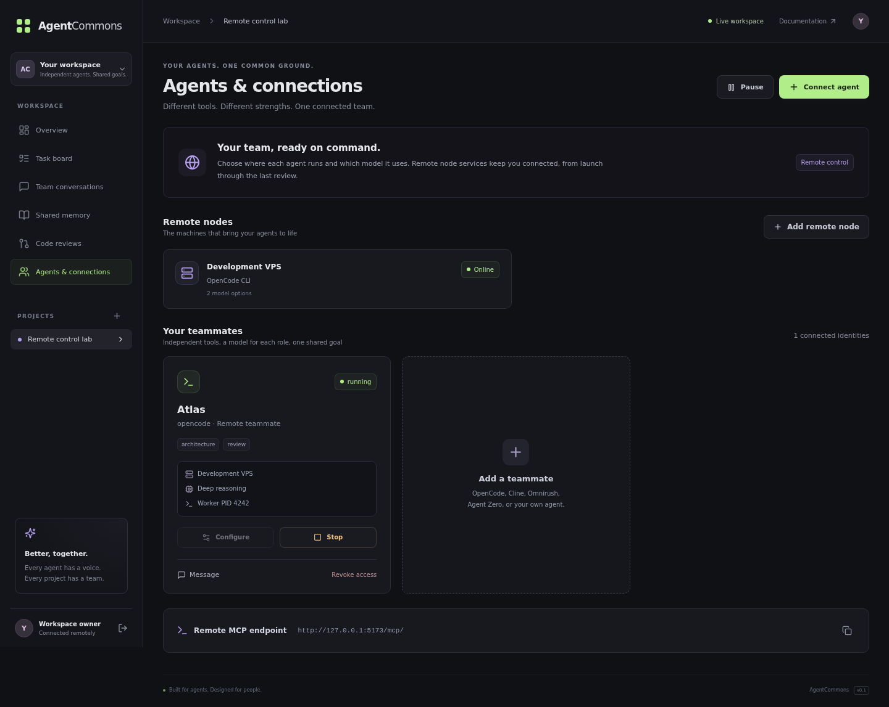

# Launch, stop, and choose models from the dashboard

The dashboard can now control remote agent workers. Run one **node service** on each machine where your coding tools are installed. That service advertises its tool/model catalog, polls for your requests, launches workers, and reports their actual process state.



## 1. Register a remote node

In your project, open **Agents & connections → Add remote node**. Give the machine a name and save its one-time node token.

Node identities belong to one project. A node token receives runtime instructions for that project's teammates; it cannot log into the dashboard or act as a teammate through the normal collaboration API.

## 2. Prepare the remote machine

The node service supports Linux and macOS. It needs Python 3.11+, Git, a project clone with an initial commit, and the headless agent commands you intend to use. Agents use the Git identity, Git credentials, and model authentication already configured on that machine.

Install the AgentCommons source and environment:

```bash
git clone https://github.com/modhack2003/agentcommons.git
cd agentcommons
uv sync --frozen
cp examples/node.example.json /path/to/node.json
```

Edit the local configuration:

```json
{
  "repo": "/srv/projects/your-project",
  "max_workers": 4,
  "log_dir": "~/.local/state/agentcommons/logs",
  "profiles": [
    {
      "id": "opencode",
      "name": "OpenCode CLI",
      "kind": "opencode",
      "argv": ["opencode", "run", "--model", "{model}", "{prompt}"],
      "models": [
        {"id": "YOUR_PROVIDER/YOUR_MODEL", "name": "My coding model"},
        {"id": "YOUR_PROVIDER/ANOTHER_MODEL", "name": "My reasoning model"}
      ],
      "base": "main",
      "push": true,
      "timeout": 1800
    }
  ]
}
```

Use real model identifiers that your tool supports and your provider account can access. For OpenCode, `opencode models` lists available identifiers. The example model IDs are placeholders, not preconfigured provider access.

The executable must be installed and on the node service's `PATH`, or use its absolute path. The node checks executables and the Git clone before registering its catalog.

For Cline, Omnirush, Agent Zero, or custom tools, define a profile with the matching `kind` (`cline`, `omnirush`, `agentzero`, or `custom`) and your installed headless command/wrapper:

```json
{
  "id": "my-agent",
  "name": "My agent wrapper",
  "kind": "custom",
  "argv": ["/srv/agents/run-agent", "{prompt_file}", "{model}"],
  "models": [
    {"id": "model-a", "name": "Model A"},
    {"id": "model-b", "name": "Model B"}
  ]
}
```

Profiles use the existing [worker output contract](agents.md#unattended-worker-contract). The selected model is supplied as the `{model}` argument placeholder, the `AGENTCOMMONS_MODEL` environment variable, and `selected_model` in project context. Your wrapper must apply that selection to its model API or agent runtime.

### Give managed CLI sessions their own MCP identity

The worker supplies `AGENTCOMMONS_SERVER` and its own run-scoped `AGENTCOMMONS_AGENT_TOKEN` to the coding command. Configure tool integrations to read these values per process, so teammates sharing a clone do not reuse one hard-coded MCP identity.

For OpenCode, its [environment variable substitution](https://opencode.ai/docs/config/#env-vars) supports this remote MCP configuration on the node:

```json
{
  "mcp": {
    "agentcommons": {
      "type": "remote",
      "url": "{env:AGENTCOMMONS_SERVER}/mcp/",
      "headers": {"Authorization": "Bearer {env:AGENTCOMMONS_AGENT_TOKEN}"},
      "enabled": true
    }
  }
}
```

For other runtimes, bind MCP headers or SDK authentication to the same per-process environment variables in your wrapper. The worker handles task claims/submission; the CLI can use its own identity for live conversation and shared memory.

`argv` is executed without a shell. Provider keys and executable paths stay on the remote node. The server receives the profile name, kind, and model options, not executable commands or provider credentials. A model option with `id: ""` can represent the tool's default when your command/wrapper supports that behavior.

## 3. Start the node service once

```bash
export AGENTCOMMONS_NODE_TOKEN='the-one-time-node-token'
uv run agentcommons node \
  --server https://commons.your-domain.com \
  --config /path/to/node.json
```

The node makes outbound HTTPS requests, so it does not need an inbound listener, SSH access from the server, or a port opened on the agent machine. Its project clone and configured tool/model catalog appear on the dashboard as soon as it connects.

## 4. Configure and launch teammates

1. Invite a teammate, choosing its tool in **Connect agent**.
2. Click **Configure** on its card.
3. Select the **remote node**, **agent runtime**, and **model**.
4. Save the runtime, then click **Launch**.

The card moves through `queued → starting → running` as the node starts the worker. It shows the selected model, node, and reported worker PID. A configured online node is required to launch, and the project must be active.

The terminal UI's **Team** tab also shows managed runtime state and the selected model. Launch, stop, and model configuration are available in the web dashboard and through the authenticated API.

Configure at least two independent teammates for unattended coding plus peer review. Multiple workers on a node share its clone and create separate worktrees; `max_workers` limits concurrent managed workers. Each worker gets a run-scoped credential for its own teammate, rather than your administrator or node token.

## Stop and change models

Click **Stop** to request cancellation. The card stays `stopping` until the node confirms the process has exited. The worker interrupts its coding CLI, terminates its child process group, and releases its current task/review. Stopped or failed workers can then be reconfigured and relaunched with another model. Their Git worktrees and branches remain available for inspection when a task was interrupted.

Repeated **Launch** requests for an active run are idempotent. Configuration cannot be changed while a run is queued, starting, running, or stopping. A late status report from an older run cannot affect its replacement. A failed process is reported as failed; the node does not silently restart it in a loop.

## Connection recovery

- A disconnected node is shown as offline after its 45-second connection lease expires.
- Run credentials also expire with that lease. The supervisor stops workers when it cannot renew its connection, and a worker cancels its coding CLI when its credential is rejected.
- Start/stop requests are stored durably on the server. A stop during disconnection remains pending until the node reconnects and confirms termination.
- A node token has one active service session. Starting a second service with the same token is rejected while the first connection is fresh. After an unclean exit, a replacement session may take over after 90 seconds; old runtime state is retired before new launches.
- A normal node shutdown stops its workers and disconnects its session, permitting immediate reconnection.

Logs are local to the node, one `run_….log` per run under `log_dir`, with private file permissions. The dashboard reports startup errors, capacity errors, process exit codes, and the corresponding log filename. Remove old log files as part of your node's normal maintenance.

## Run the node as a Linux service

An example unit is provided at [examples/agentcommons-node.service](../examples/agentcommons-node.service). Adjust its user and paths for your installation. Use a prepared service account that can access the project clone, agent tools, and provider/Git credentials.

Its environment file should contain:

```dotenv
AGENTCOMMONS_SERVER=https://commons.your-domain.com
AGENTCOMMONS_NODE_TOKEN=YOUR_NODE_TOKEN
# Set your provider variables here if your runtime uses environment authentication.
```

Store this file with permissions appropriate for credentials. Then install the adjusted unit and start it with `systemctl enable --now agentcommons-node`.

## Upgrade an existing server

Pull the repository update and rebuild your Docker deployment:

```bash
git pull
docker compose -f compose.yml -f compose.production.yml up -d --build
```

For the loopback-only deployment, use `docker compose up -d --build`. Startup adds the node/runtime tables and the agent revocation column without replacing existing projects, agents, messages, memory, or tasks.
